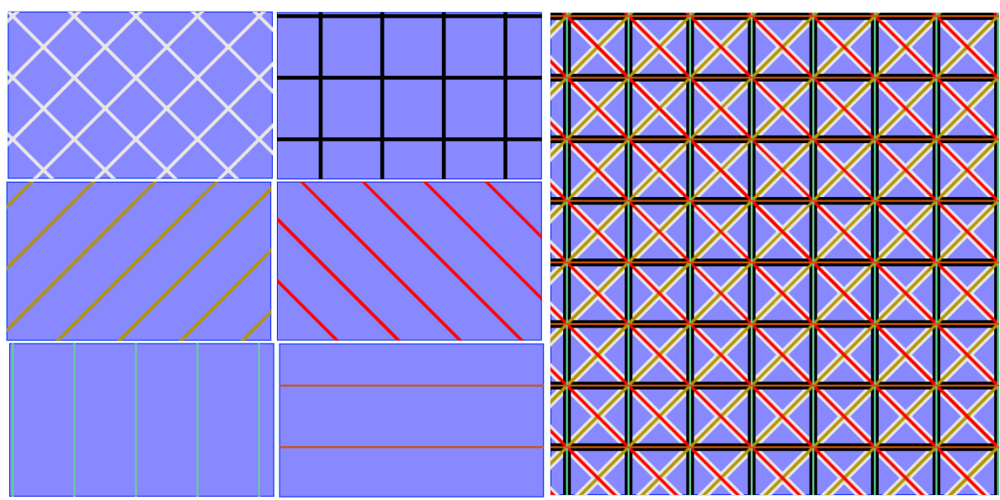
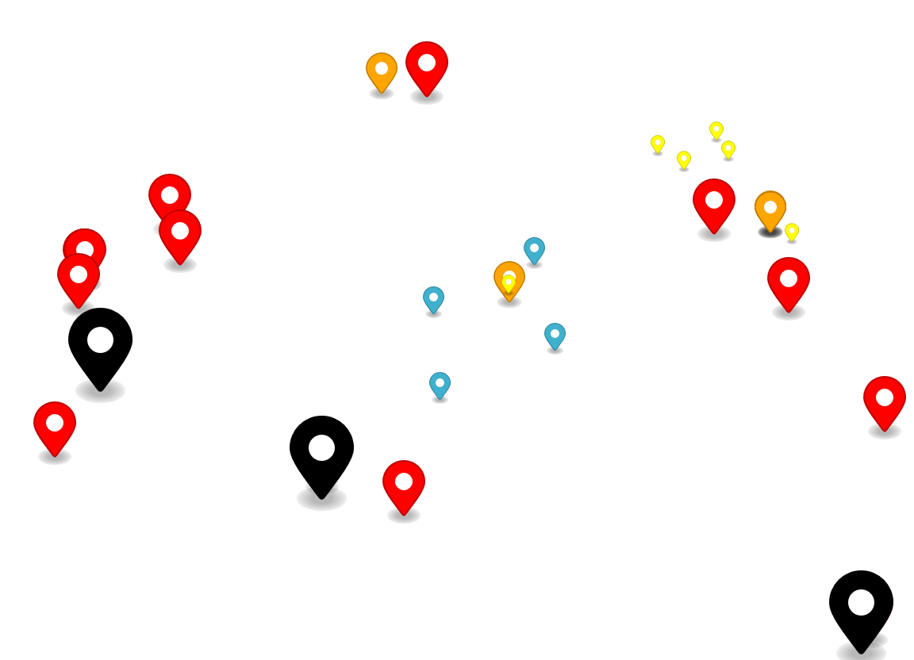

# MapLibre Symbol Utils

Utility functions for the creation of advanced symbols within MapLibre.

## Currently available Utilities:

* [canvasFill](#canvasFill)
* [addMarkerImageToMap](#addMarkerImageToMap)
* [LoadMSUImages](#LoadMSUImages)

## Quickstart

The library is dependent on using [MapLibre GL JS](https://www.npmjs.com/package/maplibre-gl).
You can install it via NPM:

```npm i maplibre_symbol_utils```

Then import the utility you want to use via:

```JavaScript
import  {addMarkerImageToMap, canvasFill, LoadMSUImages} from 'maplibre_symbol_utils';

```

Or use it directly from the CDN at [UNPKG.com](https://unpkg.com/) in your HTML:

```html
<!-- MapLibre first, then import maplibre_symbol_utils-->
<link href="https://unpkg.com/maplibre-gl/dist/maplibre-gl.css" rel="stylesheet" />
<script src="https://unpkg.com/maplibre-gl/dist/maplibre-gl.js"></script>

<script src="https://unpkg.com/maplibre_symbol_utils/dist/maplibre_symbol_utils.js"></script>
```

Then use the utility you want:

```JavaScript
const {addMarkerImageToMap, canvasFill} = maplibre_symbol_utils;

let map = new maplibregl.Map({
    container: 'map',
    zoom:0,
    style:style
    });

map.on('load', function() {
    addMarkerImageToMap('marker', {map:map})
    map.addImage('canvasFillImage',  new canvasFill( params))
})

```


<a id="LoadMSUImages"></a>

### LoadMSUImages

Creates multiple images from a JSON object and adds them to a map.

<a id="LoadMSUImages-params"></a>

#### Parameters

* map - The map to add the images to.
* style - JSON object as described in the [structure](#LoadMSUImages-structure) below.
* callback  - The callback function to be called after the images are added to the map. Supports only one callback for all images. 


<a id="LoadMSUImages-structure"></a>

#### Structure

The JSON should have the following structure:

```JSON
{
    "canvasFills": [
        {
            "id" : "string", // the id for the image
            // the options for the canvasFill
            "fillOptions":{ 
                // the options for the canvasFill
                // see canvasFill Parameters below

            }
        }
    ],
    "markerImages": [
        {
            "id" : "string", // the id for the image
            // the options for the marker
            "markerOptions":{ 
                // the options for the marker
                // see addMarkerImageToMap Parameters below
            }
        }
    ]
}
```

Note that callback for individual images is not supported in this function.

<a id="LoadMSUImages-examples"></a>

#### Example:

```JavaScript
let MSUImages = {
    canvasFills: [
        {"id":'canvasFillImage',
        fillOptions: {
            size: 512,
            backGroundColor: 'rgba(20,20,255,0.5)',
            factor: 64,
            keepRepainting: true,
            lines: [
                {color:'rgba(230,230,230,1)',type:'esriSFSDiagonalCross',width:8},    
                {color:'rgba(0,0,0,255)',type:'+',width:8},
                {color:'rgba(180,150,0,255)',type:'esriSFSForwardDiagonal',width:2},
                {color:'rgba(255,0,0,255)',type:'esriSFSBackwardDiagonal',width:2},
                {color:'rgba(100,205,150,255)',type:'esriSFSVertical',width:2},
                {color:'rgba(200,85,13,255)',type:'esriSFSHorizontal',width:2}
            ]
        }}
    ],
    markerImages: [
        {"id":'marker'}, // default marker
        {"id":'yellow-marker', 
            markerOptions:{'anchor': 'bottom', 'scale':0.7, 'color':'yellow'}},
        {"id":'orange-marker', 
            markerOptions:{ 'anchor': 'bottom', 'scale':1.5, 'color':'orange'}},
        {"id":'red-marker', 
            markerOptions:{'anchor': 'bottom', 'scale':2, 'color':'red'}},
        {"id":'black-marker', 
            markerOptions:{'anchor':'bottom', 'scale':3, 'color':'black'}}
    ]

}

map.on('load', function() {
    LoadMSUImages(MSUImages, map)
})

// Or use the callback

map.on('load', function() {
    LoadMSUImages(MSUImages, map, function(){
        console.log('All images loaded')
        // run a function that adds layers that use the images
    })
})

```


<a id="canvasFill"></a>

### canvasFill (class)

Creates and returns an object that can be used as a fill image for polygons. This is an implementation of a MapLibre GL JS  [StyleImageInterface](https://maplibre.org/maplibre-gl-js/docs/API/interfaces/StyleImageInterface/).  
The image can include a background and an array of lines according to patterns.  
This allows you to recreate symbology similar to QGIS Line Pattern Fill or ArcGIS Hatch Fill.  



Patterns have multiple accepted ways of writing their names, as seen in the table below:  

<a id="Pattrens"></a>

| Pattern                     | Accepted Names                                   |
|-----------------------------|--------------------------------------------------|
| BackSlash ( \ )             | '\\', 'Backslash' , 'esriSFSBackwardDiagonal'    |
| ForwardSlash ( \ )          | '/', 'ForwardSlash' , 'esriSFSForwardDiagonal'   |
| Cross ( + )                 | '+', 'cross' , 'esriSFSCross'                    |
| Horizontal line ( - )       | '-', 'Horizontal' , 'esriSFSHorizontal'          |
| Vertical line ( \| )        | '\|', 'Vertical' , 'esriSFSVertical'             |
| esriSFSDiagonalCross ( x )  | 'x', 'esriSFSDiagonalCross'                      |


<a id="canvasFill-params"></a>

#### Parameters

* **backGroundColor**? (String) - The background color of the image. Default value `'rgba(0,0,0,0)'`  
* **size**? (number) - The size of the image. Default value `512`
* **factor**? (number) - A number by which the size is divisible, used to determine the number of times the line pattern will repeat. Default value `16`
* **keepRepainting**? (boolean) - If true, the image will be repainted on every map repaint. Default value `false`
* **lines**? (LineOptions[]) - The lines to be drawn on the image.

<a id="canvasFill-lines"></a>

#### Line Options

 * **color** - The color of the line.
 * **width**? (integer) - The width of the line. Default value `1`.
 * **type**? (string) - The type of the line. See table of [Pattrens](#Pattrens) above.
 * **factor**? (integer) - The factor of the lines. Default value `16`.
 * **lineCap**? (string) - The shape used to draw the end points of lines. Can be one of butt, round, or square. See [CanvasRenderingContext2D.lineCap](https://developer.mozilla.org/en-US/docs/Web/API/CanvasRenderingContext2D/lineCap). Default value `'square'`
 
<a id="canvasFill-examples"></a>

#### Examples:

```JavaScript

    if(!map.hasImage('DiagonalCross')){
        map.addImage('DiagonalCross',new canvasFill(  {
            size: 512,
            backGroundColor: 'rgba(20,20,255,0.5)',
            factor: 64,
            lines: [
                {color:'rgba(230,230,230,1)',type:'esriSFSDiagonalCross',width:3}
            ]
        }))
    }
    if(!map.hasImage('Cross')){
        map.addImage('Cross',new canvasFill(  {
            size: 512,
            backGroundColor: 'rgba(20,20,255,0.5)',
            factor: 64,
            lines: [
                {color:'rgba(0,0,0,255)',type:'esriSFSCross',width:4}
            ]
        }))
    }
    
    if(!map.hasImage('ForwardDiagonal')){
        map.addImage('ForwardDiagonal',new canvasFill( {
            size: 512,
            backGroundColor: 'rgba(20,20,255,0.5)',
            factor: 64,
            lines: [
                {color:'rgba(180,150,0,255)',type:'esriSFSForwardDiagonal',width:2}
            ]
        }))
    }
    if(!map.hasImage('BackwardDiagonal')){
        map.addImage('BackwardDiagonal', new canvasFill( {
            size: 512,
            backGroundColor: 'rgba(20,20,255,0.5)',
            factor: 64,
            lines: [
                {color:'rgba(255,0,0,255)',type:'esriSFSBackwardDiagonal',width:2}
            ]
        }))
    }
    if(!map.hasImage('Vertical')){
        map.addImage('Vertical',new canvasFill(  {
            size: 512,
            backGroundColor: 'rgba(20,20,255,0.5)',
            factor: 64,
            lines: [
                {color:'rgba(100,205,150,255)',type:'esriSFSVertical',width:2}
            ]
        }))
    }
    if(!map.hasImage('Horizontal')){
        map.addImage('Horizontal',new canvasFill(  {
            size: 512,
            backGroundColor: 'rgba(20,20,255,0.5)',
            factor: 64,
            lines: [
                {color:'rgba(200,85,13,255)',type:'esriSFSHorizontal',width:2}
            ]
        }))
    }

    // Combine multiple line types 
    let params = {
            size: 512,
            backGroundColor: 'rgba(20,20,255,0.5)',
            factor: 64,
            keepRepainting: true,
            lines: [
                {color:'rgba(230,230,230,1)',type:'esriSFSDiagonalCross',width:8},    
                {color:'rgba(0,0,0,255)',type:'+',width:8},
                {color:'rgba(180,150,0,255)',type:'ForwardDiagonal',width:2},
                {color:'rgba(255,0,0,255)',type:'esriSFSBackwardDiagonal',width:2},
                {color:'rgba(100,205,150,255)',type:'-',width:2},
                {color:'rgba(200,85,13,255)',type:'Horizontal',width:2}
            ]
        }

    if(!map.hasImage('canvasFillImage')){
        map.addImage('canvasFillImage',  new canvasFill( params))
    }
```

<a id="addMarkerImageToMap"></a>

### addMarkerImageToMap

Creates an image from a [maplibre.Marker](https://docs.mapbox.com/mapbox-gl-js/api/markers/#marker) and adds it to a map specified in the options.
This allows you to use the relatively flexible maplibre [Marker](https://maplibre.org/maplibre-gl-js/docs/API/classes/Marker) as an icon image for entire point layers, or in any other use of images in your map.
It's worth noting that you can use the [element](https://maplibre.org/maplibre-gl-js/docs/API/type-aliases/MarkerOptions/#element) options and replace the default marker with another HTML element.



<a id="addMarkerImageToMap-params"></a>

#### Parameters

* id (string) - The image id, if `id` already exists, an error will be thrown.
* options (extended [maplibre.MarkerOptions](https://maplibre.org/maplibre-gl-js/docs/API/type-aliases/MarkerOptions/)) - An object containing MapLibre marker creation options with an additional `map` value is also required.
* @param {MapLibreMap} options.map - The map to add the image to.
* @param {Function} callback  - The callback function to be called after the image is added to the map. 


<a id="addMarkerImageToMap-example"></a>

#### Parameters

```JavaScript
    // You can just use the default marker
    addMarkerImageToMap('marker', {map:map})
    // Or play with the color, anchoring, scale, and even the element used
    addMarkerImageToMap('yellow-marker', {map:map, 'anchor': 'bottom', 'scale':0.7, 'color':'yellow'})
    addMarkerImageToMap('orange-marker', {map:map, 'anchor': 'bottom', 'scale':1.5, 'color':'orange'})
    addMarkerImageToMap('red-marker', {map:map, 'anchor': 'bottom', 'scale':2, 'color':'red'})
    addMarkerImageToMap('black-marker', {map:map, 'anchor':'bottom', 'scale':3, 'color':'black'})

    map.addLayer({
        'id': 'earthquakes',
        'type': 'symbol',
        'source': '25_day_1',
        'layout': {
            'icon-image': ['case',
            ['all', ['>=', ['get', 'mag'], 2], ['<', ['get', 'mag'], 3]],
            'yellow-marker',
            ['all', ['>=', ['get', 'mag'], 3], ['<', ['get', 'mag'], 4]],
            'orange-marker',
            ['all', ['>=', ['get', 'mag'], 4], ['<', ['get', 'mag'], 5]],
            'red-marker',
            ['>=', ['get', 'mag'], 5],
            'black-marker',
            'marker'
            ],
            'icon-size': 1,
            'icon-allow-overlap':true
        }
    });

    map.addLayer({
        'id': 'points',
        'type': 'symbol',
        'source': 'points',
        'layout': {
            'icon-image': 'marker'
        }
    })
```